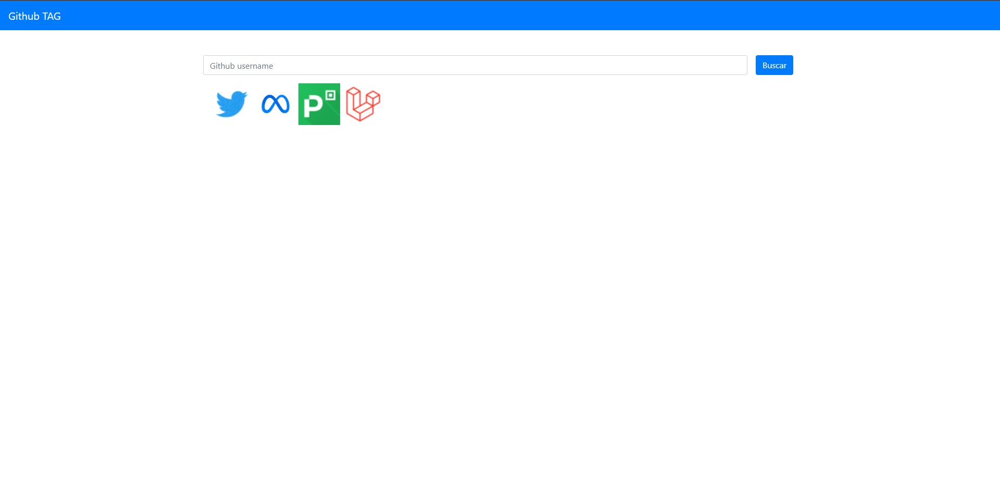

# Github TAG


## About

Github TAG is a simple app to consume Github API, and git some information about the user and repositories.

## Routes
```text
    Home: http://localhost:8000/
    Search: http://localhost:8000/search?username={github_username}
```

## Preview




## Database

```sql
table: search_history
    id -> int
    username -> string
    email-> string
    avatar_url -> string
    profile_url -> string
    total_repos -> int
```

## Building
You'll need Composer installed on your computer in order to build this app.
```bash
$ git clone https://github.com/eric-souzams/github-tag.git
$ cd github-tag
$ composer install
$ php artisan serve
```
## License

The Laravel framework is open-sourced software licensed under the [MIT license](https://opensource.org/licenses/MIT).
